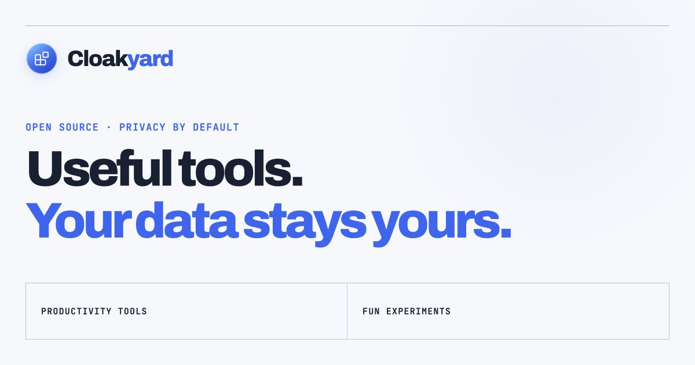

<div align="center">

# Cloakyard

  <p><strong>Privacy-first, open source tools—made useful, then made beautiful.</strong></p>
  <p>The home of CloakPDF, CloakResume, CloakIMG, CloakDrop, and the experiments that do not fit in a productivity drawer.</p>

  <p><a href="https://cloakyard.com/">cloakyard.com</a></p>

  <p>
    <a href="https://opensource.org/licenses/MIT"></a>
    
    <a href="https://viteplus.dev/"></a>
    
  </p>

</div>

<p align="center">
  
</p>

---

## 🌱 The yard

### 🛠️ Productivity

- **[CloakPDF](https://pdf.cloakyard.com)** — edit, annotate, redact, reorganise, and export PDFs locally in the browser.
- **[CloakResume](https://resume.cloakyard.com)** — build, tailor, review, and export an ATS-friendly résumé without uploading your career history.
- **[CloakIMG](https://img.cloakyard.com)** — a private photo editor with retouching, metadata removal, and optional on-device AI.
- **[CloakDrop](https://drop.cloakyard.com)** — a native macOS download manager with adaptive range transfers and zero telemetry.

### 🧪 Fun experiments

- **[KERR](https://kerr.cloakyard.com)** — a relativistic black-hole visualiser with a generative cinematic score, running entirely in the browser.

Product copy, destinations, status, and icons live in one registry: [`src/data/tools.ts`](src/data/tools.ts). Add a project there and compose a matching section only when the new project needs more than a standard tool entry.

---

## 🧭 Principles

- **Open source** — the code is part of the product and should be readable, auditable, and welcoming to improve.
- **Privacy by architecture** — local processing and minimal network surfaces come before privacy copy.
- **Design with intent** — privacy tools should also be legible, responsive, and pleasant to use.

The site makes no API calls, has no account layer, and ships no analytics.

---

## ⚙️ Tech stack

| Area      | Technology                                                              |
| --------- | ----------------------------------------------------------------------- |
| UI        | [React 19](https://react.dev/) + TypeScript 7                           |
| Toolchain | [Vite+](https://viteplus.dev/) — dev, checks, build, package management |
| Icons     | [Lucide](https://lucide.dev/)                                           |
| Styling   | Hand-authored responsive CSS with self-hosted Archivo + JetBrains Mono  |
| Hosting   | Cloudflare Workers static assets                                        |

The production site is a small client-rendered React app. There is no router, backend, database, state library, or runtime data fetch because the homepage does not need them.

---

## 🚀 Getting started

Requires **Node.js 24 or newer** and the Vite+ CLI.

```bash
curl -fsSL https://vite.plus | bash
git clone https://github.com/cloakyard/cloakyard.git
cd cloakyard
vp install
vp dev
```

| Command         | Purpose                                |
| --------------- | -------------------------------------- |
| `vp dev`        | Start the local development server     |
| `vp check`      | Format, lint, and type-check           |
| `vp build`      | Create the production build in `dist/` |
| `vp preview`    | Preview the production build           |
| `vp run deploy` | Check, build, and deploy with Wrangler |

---

## 🗂️ Structure

```text
cloakyard/
├── public/
│   ├── fonts/                 # Self-hosted Archivo + JetBrains Mono
│   ├── cloakyard-mark.svg     # Primary brand mark and favicon
│   ├── og.png                 # 1200×630 social preview
│   ├── robots.txt
│   └── sitemap.xml
├── src/
│   ├── components/            # Header, hero, tool cards, experiment, principles, footer
│   ├── data/tools.ts          # Tool registry and destinations
│   ├── App.tsx                # One-page composition
│   ├── index.css              # Design tokens and responsive system
│   └── main.tsx               # React entry
├── index.html                 # Metadata, font preloads, and structured data
├── vite.config.ts             # Vite+ / React configuration
└── wrangler.jsonc             # Cloudflare Workers static-assets configuration
```

---

## ☁️ Deploying to Cloudflare Workers

The site builds to static assets and deploys as a Cloudflare Worker.

```bash
vp run deploy
```

For Cloudflare Workers Builds connected to Git:

1. Select the `cloakyard/cloakyard` repository.
2. Set the build command to `vp build`.
3. Set the deploy command to `vp exec wrangler deploy`.
4. Attach `cloakyard.com` as the Worker custom domain.

Pull requests can use Cloudflare preview deployments; pushes to the production branch publish the Worker.

---

## 🤝 Contributing and license

Contributions are welcome. Keep the homepage focused: it is a directory and statement of principles, not a second marketing site for every product.

Licensed under the [MIT License](LICENSE).

<p align="center">Built with care by <a href="https://github.com/sumitsahoo">Sumit Sahoo</a></p>
